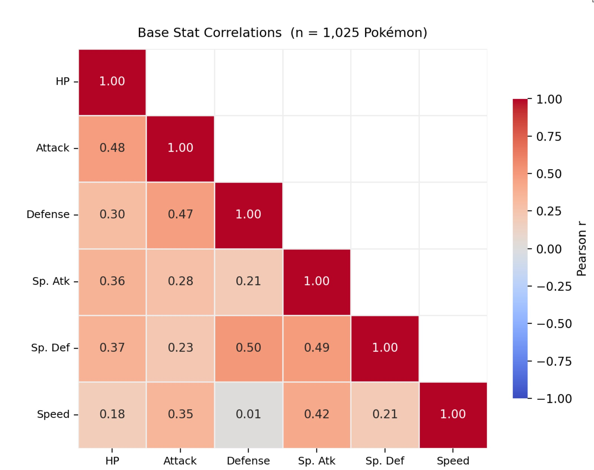

# Pokémon Data Pipeline & Dashboard

Built to demonstrate end-to-end data engineering skills — from rate-limited API ingestion and relational schema design through to interactive analytics. The pipeline fetches the complete Pokédex (1025 Pokémon, 102k+ move records) from a public REST API, models it across 10 relational tables in SQLite, and surfaces it through a multi-tab Streamlit dashboard with live sidebar filtering. The project is structured so each layer is independently testable: the fetch script, the ORM schema, the pandas analysis functions, and the dashboard are all separate concerns.

**Stack:** Python · SQLite (SQLAlchemy ORM) · pandas · Streamlit · matplotlib · seaborn

---

## Project structure

```
pokemon-pipeline/
├── fetch.py       # Data pipeline — fetches from PokéAPI, writes to SQLite
├── database.py    # SQLAlchemy models + schema migrations
├── analyze.py     # Analysis layer — pure pandas, no Streamlit imports
├── app.py         # Streamlit dashboard
└── data/
    └── pokemon.db # SQLite database (generated by fetch.py)
```

---

## Architecture decisions

### Separation of concerns
`analyze.py` has no Streamlit imports — all data logic lives there and is independently testable. `app.py` imports from `analyze.py` and handles only display and state. This also avoids a Streamlit-specific issue: Streamlit re-executes `app.py` on every interaction but imports `analyze.py` only once at server startup, so keeping analysis functions pure and stateless prevents stale-cache bugs.

### SQLAlchemy ORM over raw SQL
The schema is defined declaratively in `database.py`, giving typed models, relationship navigation, and a `run_migrations()` helper that adds new columns to an existing DB without data loss. This made it straightforward to add `is_legendary`, `is_mythical`, and `is_baby` columns after the initial fetch was complete.

### Two-pass fetch strategy
`fetch.py` runs in two passes:
1. **Per-Pokémon pass** — fetches `/pokemon/{id}` and `/pokemon-species/{id}` for each of the 1025 Pokémon, resolving abilities and moves along the way. Abilities and moves are cached in-process so each unique resource is only fetched once per run.
2. **Per-chain pass** — collects all evolution chain IDs encountered in pass 1, then fetches each unique chain exactly once. This is more efficient than fetching a chain per Pokémon (many share chains).

### Polite API usage
A 0.1 s delay is inserted between every request (`REQUEST_DELAY`). The HTTP client has 3-retry exponential backoff for transient failures. A `--species-only` flag allows targeted re-fetches of just the classification fields (~2 min, 1025 calls) without re-fetching the full dataset.

### Evolution stage derivation
Stage 1 / Stage 2 / Stage 3 / Standalone are derived from the `evolutions` table at query time, not stored. The logic uses set membership (`from_ids`, `to_ids`) to classify each Pokémon, with classification priority: Baby > Legendary > Mythical > derived stage. This keeps the derivation in one place and makes it easy to update.

---

## Data collected

| Table            | Rows    | Description                                      |
|------------------|---------|--------------------------------------------------|
| `pokemon`        | 1,025   | Core Pokémon data with classification flags      |
| `base_stats`     | 1,025   | HP, Attack, Defense, Sp. Atk, Sp. Def, Speed    |
| `types`          | 18      | Type lookup table                                |
| `pokemon_types`  | ~1,600  | Many-to-many: each Pokémon has 1–2 types         |
| `generations`    | 9       | Generation and region metadata                   |
| `abilities`      | 284     | Ability names and English effect text            |
| `pokemon_abilities` | ~2,400 | Which Pokémon have which abilities (+ hidden flag) |
| `moves`          | 797     | Move stats: type, power, accuracy, PP, category  |
| `pokemon_moves`  | 102,306 | Learnset: one row per (Pokémon, move, learn method) |
| `evolution_chains` + `evolutions` | 469 edges | Directed evolution graph |

Classification breakdown: Legendary = 71, Mythical = 23, Baby = 19, Stage 1 = 306, Stage 2 = 346, Stage 3 = 118, Standalone = 142.

---

## Key findings

- **Strongest stat correlation: Defense & Sp. Def (r = 0.50)** — physically and specially defensive stats rise together, suggesting "wall"-archetype Pokémon are consistently bulky in both dimensions.
- **Most independent pair: Speed & Defense (r = 0.01)** — fast Pokémon are no more likely to be physically defensive than slow ones, confirming the glass-cannon / tank split.
- **Average off-diagonal r = 0.32** — stats are moderately correlated overall; Pokémon tend toward generalist profiles rather than extreme specialisation.
- **Flying is almost never a primary type** — the grouped type chart reveals Flying has very few primary-type Pokémon but is one of the most common secondary types (Pidgey, Charizard, etc.).
- **Generation V is the largest** — 156 Pokémon introduced, more than any other generation.

---

## Dashboard




Run with:

```powershell
venv\Scripts\streamlit.exe run app.py
```

### Sidebar filters (apply to all tabs)
- **Generation** — multiselect, Gen I–IX
- **Type** — multiselect, all 18 types
- **Classification** — Stage 1/2/3, Standalone, Baby, Legendary, Mythical

### Tabs

**Overview** — summary metrics (Pokémon count, types, generations, avg total stat) and a grouped horizontal bar chart showing primary vs secondary type frequency per type. Flying stands out as almost exclusively a secondary type.

**Stats by Type** — ranked horizontal bar chart of average base stats by type, with a "Rank by" selectbox. Dragon and Psychic lead on total; Bug and Normal trail. Dual-type Pokémon count toward both types. Includes an expandable heatmap of all six stats simultaneously.

**Stats by Generation** — multi-stat line chart across generations with muted count bars on a secondary axis (labelled `n=XX`). An "All 6 stats" checkbox overrides the multiselect. Single-stat mode adds per-point value annotations.

**Analysis** — lower-triangular Pearson correlation heatmap for the six base stats, computed from the current filter. Key findings displayed as metrics below the chart.

**Pokémon Explorer** — searchable, sortable table of all Pokémon in the current filter. Selecting a Pokémon shows a full profile: sprite, type/gen metrics, stat bar chart, abilities with effect text, evolution chain with sprites, and move learnset grouped by learn method (Level Up, TM/HM, Egg, Tutor).

---

## How to reproduce

```powershell
# 1. Create and activate virtualenv
python -m venv venv
venv\Scripts\Activate.ps1

# 2. Install dependencies
pip install requests sqlalchemy pandas streamlit matplotlib seaborn numpy

# 3. Fetch all data (~30 min, ~1025 * 3+ API calls)
python fetch.py

# 4. Launch dashboard
venv\Scripts\streamlit.exe run app.py
```

To re-fetch only the classification flags (Legendary/Mythical/Baby) on an existing database:

```powershell
python fetch.py --species-only
```

---

## Development notes

Built with AI assistance (Claude, Anthropic) for boilerplate generation and debugging. All architecture decisions, analytical direction, and project design are my own.
