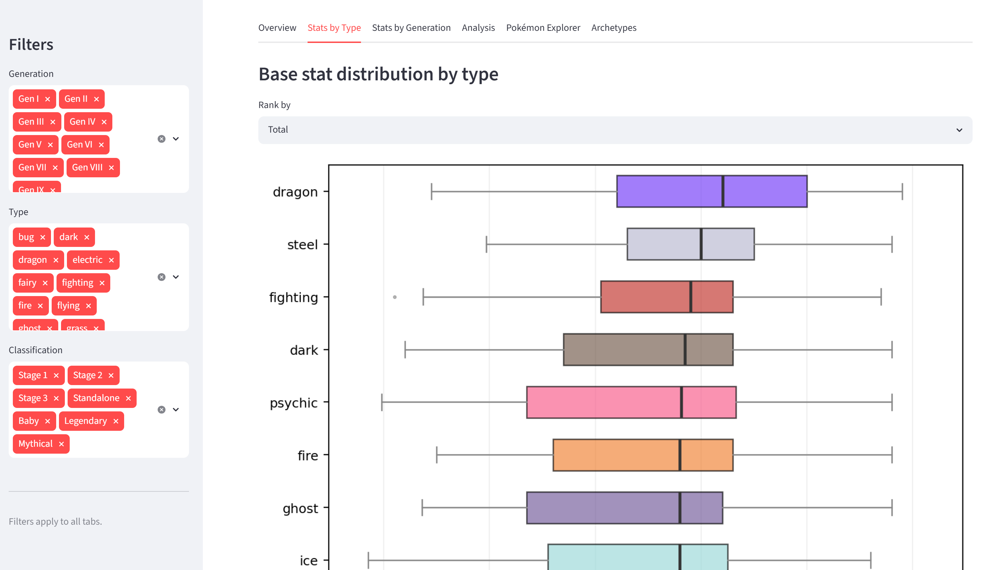
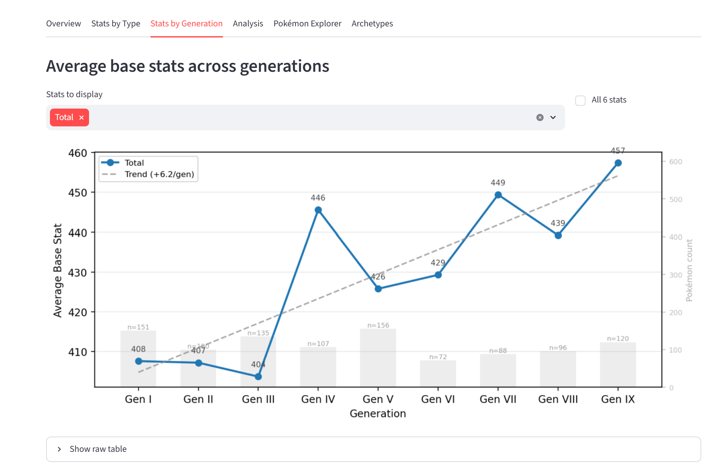
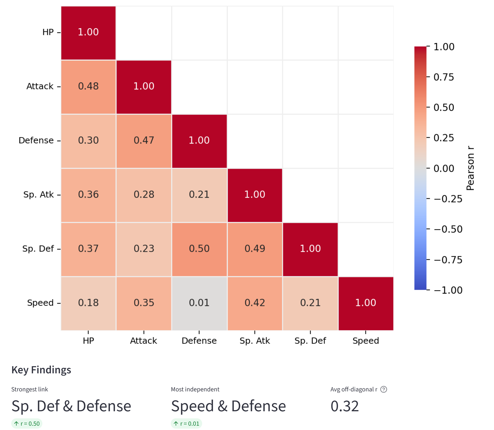
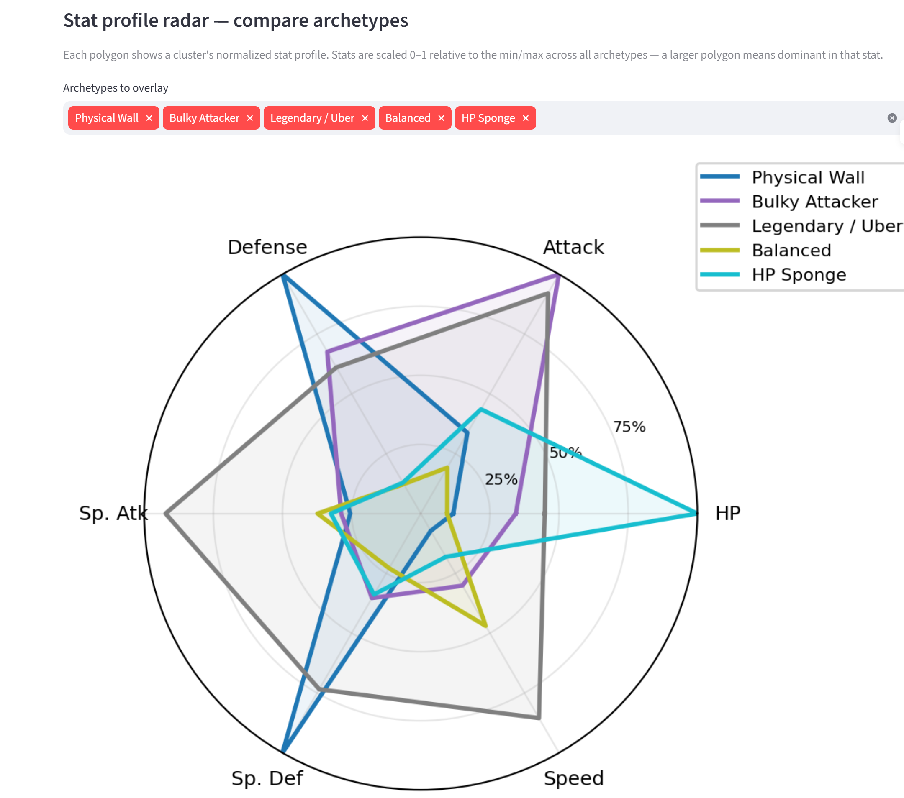

# Pokémon Data Pipeline & Dashboard

Built to demonstrate end-to-end data engineering skills — from rate-limited API ingestion and relational schema design through to interactive analytics and formal statistical analysis. The pipeline fetches the complete Pokédex (1,025 Pokémon, 102k+ move records) from a public REST API, models it across 10 relational tables in SQLite, and surfaces it through a multi-tab Streamlit dashboard with live sidebar filtering. A companion Jupyter notebook layers formal hypothesis tests, regression, and unsupervised clustering on top of the same database. Each layer is independently testable: the fetch script, the ORM schema, the pandas analysis functions, the dashboard, and the notebook are all separate concerns.

**Stack:** Python · SQLite (SQLAlchemy ORM) · pandas · Streamlit · matplotlib · seaborn · scikit-learn · scipy

---

## Project structure

```
pokemon-pipeline/
├── fetch.py              # Data pipeline — fetches from PokéAPI, writes to SQLite
├── database.py           # SQLAlchemy models + schema migrations
├── analyze.py            # Analysis layer — pure pandas + sklearn, no Streamlit imports
├── app.py                # Streamlit dashboard
├── eda_analysis.ipynb    # Statistical analysis notebook — hypothesis tests, regression, clustering
├── requirements.txt      # Pinned dependencies
└── data/
    └── pokemon.db        # SQLite database (generated by fetch.py)
```

`eda_analysis.ipynb` is a 32-cell portfolio notebook that goes beyond the dashboard's descriptive charts. It covers: formal hypothesis testing (Mann-Whitney U), OLS regression for power creep, violin-plot type distributions with variance tables, Pearson correlation with structural interpretation, and k-means archetype clustering with the greedy labeling algorithm inlined and explained. Self-contained — connects to the SQLite DB via `get_engine()` and does not import from `analyze.py` or `app.py`.

---

## Architecture decisions

### Separation of concerns
`analyze.py` has no Streamlit imports — all data logic lives there and is independently testable. `app.py` imports from `analyze.py` and handles only display and state. This avoids a Streamlit-specific issue: Streamlit re-executes `app.py` on every interaction but imports `analyze.py` only once at server startup, so keeping analysis functions pure and stateless prevents stale-cache bugs.

### SQLAlchemy ORM over raw SQL
The schema is defined declaratively in `database.py`, giving typed models and a `run_migrations()` helper that adds new columns to an existing DB without data loss. This made it straightforward to add `is_legendary`, `is_mythical`, and `is_baby` columns after the initial fetch was complete.

### Two-pass fetch strategy
`fetch.py` runs in two passes:
1. **Per-Pokémon pass** — fetches `/pokemon/{id}` and `/pokemon-species/{id}` for each of the 1,025 Pokémon, resolving abilities and moves along the way. Abilities and moves are cached in-process so each unique resource is only fetched once per run.
2. **Per-chain pass** — collects all evolution chain IDs encountered in pass 1, then fetches each unique chain exactly once. More efficient than fetching a chain per Pokémon since many share chains.

### Polite API usage
A 0.1 s delay is inserted between every request. The HTTP client has 3-retry exponential backoff for transient failures. A `--species-only` flag allows targeted re-fetches of just the classification fields (~2 min, 1,025 calls) without re-fetching the full dataset.

### Evolution stage derivation
Stage 1 / Stage 2 / Stage 3 / Standalone are derived from the `evolutions` table at query time, not stored. The logic uses set membership (`from_ids`, `to_ids`) to classify each Pokémon, with classification priority: Baby > Legendary > Mythical > derived stage.

### Archetype labeling — greedy priority assignment
Raw K-means cluster IDs are meaningless. The naive approach — labeling each cluster by its highest average stat — fails for two reasons: (1) multiple clusters can share the same dominant stat at different power levels (three clusters might all lead on Attack but differ in whether they pair it with Speed, bulk, or mediocrity), and (2) without a priority ordering, the Legendary and Early-Stage clusters compete for labels rather than being claimed before the nuanced archetypes run.

The greedy algorithm in `_label_archetypes()` solves this by processing archetypes in priority order — most structurally unambiguous first — and removing each claimed cluster from the pool. Steps in order: Legendary/Uber (highest total, always fires), Early Stage (lowest total, normalized ≤ 0.25), Mid-Stage (next lowest, normalized ≤ 0.35), Pseudo-Legendary (highest remaining, normalized ≥ 0.75), Physical Wall (highest Defense, normalized ≥ 0.45), Special Wall (highest Sp. Def, normalized ≥ 0.45), HP Sponge (highest HP, normalized ≥ 0.55), Bulky Attacker (offense × bulk composite), Physical Sweeper (Attack × 0.6 + Speed × 0.4), Special Sweeper (Sp. Atk × 0.6 + Speed × 0.4), Balanced (fallback). Thresholds prevent mislabeling an average cluster as a specialist archetype. At k = 10, all 10 steps claim exactly one cluster and Balanced does not fire.

k = 10 was chosen via the elbow curve: inertia drops steeply from k = 2 to k = 8 as genuinely distinct tiers are separated, then flattens — adding clusters beyond 10 splits groups that share the same competitive identity. The curve is shown in both the Archetypes tab and the EDA notebook.

---

## Statistical methods

### Mann-Whitney U — Legendary vs Standard stat gap
Used to test whether Legendary Pokémon rank significantly higher in total base stats than standard Pokémon. A t-test would be inappropriate here: Legendaries cluster in a narrow high-stat band (~580 median) while standard Pokémon have a wide left-skewed distribution driven by unevolved forms (~425 median). Mann-Whitney U is non-parametric — it tests whether values from one group tend to rank higher than the other without assuming distributional shape. Mythical Pokémon were excluded from both groups to keep the comparison clean.

**Result:** U = 62,370, p = 5.12e-36. Legendary median = 580, Standard median = 425, median gap = 155 stat points. The gap is not marginal — it is equivalent to roughly an additional full stat line distributed across the profile.

### OLS linear regression — power creep across generations
Used to test whether later generations have systematically higher average total stats. Generation number (1–9) is the predictor; the dependent variable is the generation-mean total stat computed from standard Pokémon only. Legendaries and Mythicals are excluded to avoid confounding: a generation that introduced more Legendaries would show an artificially inflated mean.

**Result:** slope = +5.45 stat points per generation, R² = 0.70, p = 0.005. Statistically significant — power creep is real, and the trend is consistent enough that generation number explains 70% of the variance in generation-level means. The average standard Pokémon in Gen IX (444.5 avg total) outpaces Gen I (400.9) by ~44 points. However, R² here applies to the nine generation means, not individual Pokémon — within-generation spread (unevolved forms at ~260 vs. final evolutions at ~500+) still dominates total variance. Generation is a weak predictor of any individual Pokémon's power; it is a moderate predictor of a generation's *average* floor.

### K-means clustering — stat archetypes
All 1,025 Pokémon are clustered on their six base stats using K-means with StandardScaler normalization. Normalization is necessary: without it, total stat range (180–780) dominates the Euclidean distance metric and obscures within-tier structure. k = 10 was chosen via the elbow method (see Architecture Decisions). The fact that unsupervised clustering on raw stats recovers the competitive roles the Pokémon community independently developed over 25 years is itself a finding — these archetypes are statistically encoded in the data, not just community convention.

---

## Data collected

| Table            | Rows    | Description                                      |
|------------------|---------|--------------------------------------------------|
| `pokemon`        | 1,025   | Core Pokémon data with classification flags      |
| `base_stats`     | 1,025   | HP, Attack, Defense, Sp. Atk, Sp. Def, Speed    |
| `types`          | 18      | Type lookup table                                |
| `pokemon_types`  | ~1,600  | Many-to-many: each Pokémon has 1–2 types         |
| `generations`    | 9       | Generation and region metadata                   |
| `abilities`      | 284     | Ability names and English effect text            |
| `pokemon_abilities` | ~2,400 | Which Pokémon have which abilities (+ hidden flag) |
| `moves`          | 797     | Move stats: type, power, accuracy, PP, category  |
| `pokemon_moves`  | 102,306 | Learnset: one row per (Pokémon, move, learn method) |
| `evolution_chains` + `evolutions` | 469 edges | Directed evolution graph |

Classification breakdown: Legendary = 71, Mythical = 23, Baby = 19, Stage 1 = 306, Stage 2 = 346, Stage 3 = 118, Standalone = 142.

---

## Data quality

### Completeness
No missing values in the stat dataset — every Pokémon has a complete six-stat profile (verified via null check in `eda_analysis.ipynb`). The 3-retry exponential backoff resolved all transient API errors; there were no permanent fetch failures.

### What is not included
- **Alternate forms:** Regional variants (Alolan, Galarian, Hisuian, Paldean), Mega Evolutions, and Gigantamax forms are each separate PokéAPI resources and are not in the dataset. The 1,025 entries correspond to canonical Pokédex numbers 1–1025 only.
- **Move learnset version:** PokéAPI returns moves tied to a specific version group. This pipeline stores the first version group encountered per move–Pokémon pair; moves added or changed in later games within a generation may not reflect the most recent learnset.
- **Ability effect text:** Sourced from PokéAPI's English flavor entries; a small number have missing or truncated text depending on API completeness at fetch time.

### Known analysis limitations
- The EDA notebook uses primary type only for type-based distributions. The Streamlit dashboard counts dual-type Pokémon toward both types in the per-type charts — these two views will produce different type rankings and are intentionally different.
- Classification flags (`is_legendary`, `is_mythical`, `is_baby`) come from PokéAPI's species endpoint. Some edge cases — Ultra Beasts, Paradox Pokémon — are not classified as Legendary in PokéAPI even though competitive play treats them as restricted, meaning they appear in the Standard group in the Legendary comparison chart.

---

## Key findings

- **Legendary Pokémon are significantly stronger — confirmed statistically (p = 5.12e-36, median gap = 155 pts).** Mann-Whitney U test on total base stats (Mythicals excluded): Legendary median = 580, Standard median = 425. The gap is not just "higher on average" — the rank-based test confirms no realistic overlap between distributions. See `eda_analysis.ipynb` Section 2.

- **Power creep is real but moderate (+5.45 stat points per generation, p = 0.005, R² = 0.70).** OLS regression on generation-mean total stats (standard Pokémon only). Gen IX averages 444.5 vs Gen I at 400.9 — a 44-point rise over nine generations. The R² applies to generation means, not individual Pokémon; within-generation spread (unevolved vs. final forms) is far larger than the between-generation trend. See `eda_analysis.ipynb` Section 3.

- **Strongest stat correlation: Defense & Sp. Def (r = 0.50)** — physically and specially defensive stats rise together, but the correlation is moderate enough that Physical Wall and Special Wall emerge as structurally *separate* clusters in the k-means analysis.

- **Most independent pair: Speed & Defense (r = 0.01)** — fast Pokémon are no more likely to be physically defensive than slow ones, confirming the glass-cannon / tank split is an intentional design axis, not an emergent property.

- **Average off-diagonal r = 0.32** — stats are moderately correlated overall; Pokémon lean toward generalist profiles rather than extreme specialisation.

- **Flying is almost never a primary type** — the Overview type chart shows Flying has very few primary-type Pokémon but is one of the most common secondary types.

- **17 type combinations have no Pokémon at all** — including Fire/Ice, Ghost/Normal, Electric/Grass, and Dragon/Fairy. Of the 153 possible unordered pairs across 18 types, 11% are entirely absent.

- **Dual-type Pokémon average ~44 stat points more than single-types (435 vs 392), even after excluding legendaries and mythicals.** Broken down by evolution stage: the gap is almost entirely driven by Standalone Pokémon — single-type standalones average 432 vs 503 for dual-type, a 70-point gap. At Stage 3, the difference drops to just 5 points. The pattern is a design choice for standalone Pokémon, not a universal compensation rule.

- **Competitive archetypes are statistically encoded in the data.** K-means (k = 10) on normalised base stats recovers the roles the Pokémon community independently developed over 25 years — Physical Wall, Special Sweeper, HP Sponge, etc. — without type labels, Pokédex entries, or community input. The archetype centroids are well-separated, particularly between the Legendary/Uber tier and the next-highest cluster.

---

## Dashboard


Run with:

```powershell
venv\Scripts\streamlit.exe run app.py
```

### Sidebar filters (apply to all tabs except Archetypes)
- **Generation** — multiselect, Gen I–IX
- **Type** — multiselect, all 18 types
- **Classification** — Stage 1/2/3, Standalone, Baby, Legendary, Mythical

### Tabs

**Overview** — two summary metrics (Pokémon count, avg total stat) and a grouped horizontal bar chart showing primary vs secondary type frequency per type. Flying stands out as almost exclusively a secondary type. An expandable 18×18 dual-type combination matrix shows which type pairings exist — and the 17 that do not.

**Stats by Type** — horizontal box plots per type sorted by median of the selected stat, coloured by type. Shows the full distribution rather than just the mean — high-variance types like Dragon have a wide spread driven by outlier Legendaries, while Fairy and Steel show tighter baselines. An expandable heatmap shows all six stats simultaneously with relative-rank normalisation.



**Stats by Generation** — multi-stat line chart across generations with muted count bars on a secondary axis. Single-stat mode adds per-point value annotations and a dashed OLS regression trend line with slope annotated (e.g. `Trend (+5.4/gen)`), directly quantifying power creep rather than leaving it as a visual inference.



**Analysis** — (1) lower-triangular Pearson correlation heatmap for the six base stats, with key findings as metrics and a note on weight-based correlations; (2) **Legendary / Mythical vs. Standard** grouped bar chart comparing average stats for legendaries against any user-selected classification subset — the Classification filter controls which standard group is shown while the Legendary/Mythical group is always fixed.



**Pokémon Explorer** — searchable, sortable table of all Pokémon in the current filter. Selecting a Pokémon shows a full profile: sprite, type/gen metrics, stat bar chart, abilities with effect text, evolution chain with sprites, and move learnset grouped by learn method (Level Up, TM/HM, Egg, Tutor).

**Archetypes** — clustering always uses the full 1,025-Pokémon dataset regardless of sidebar filters, so cluster membership is stable. Shows: (1) elbow curve with k = 10 marked, (2) radar chart of normalised stat profiles per archetype with a multiselect to overlay specific archetypes for comparison, (3) average stats table, (4) plain-English description for each archetype, (5) filterable and name-searchable Pokémon list showing which Pokémon belong to each cluster.



---

## How to reproduce

```powershell
# 1. Create and activate virtualenv
python -m venv venv
venv\Scripts\Activate.ps1

# 2. Install dependencies
pip install -r requirements.txt

# 3. Fetch all data (~30 min, ~1025 * 3+ API calls)
python fetch.py

# 4. Launch dashboard
venv\Scripts\streamlit.exe run app.py

# 5. Open EDA notebook (optional)
venv\Scripts\jupyter.exe notebook eda_analysis.ipynb
```

To re-fetch only the classification flags (Legendary/Mythical/Baby) on an existing database:

```powershell
python fetch.py --species-only
```

---

## Development notes

Built with AI assistance (Claude, Anthropic) for boilerplate generation and debugging. All architecture decisions, analytical direction, statistical interpretation, and project design are my own.
